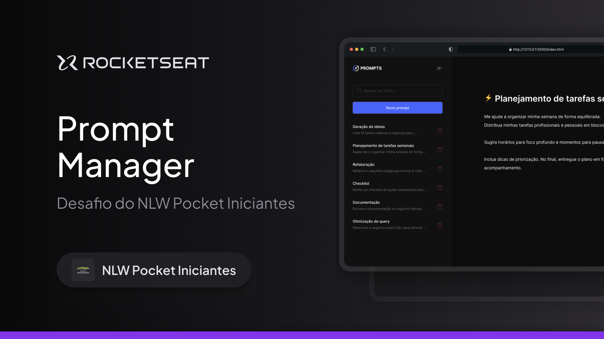

# Prompt Manager

O Prompt Manager é uma aplicação web prática e intuitiva que permite organizar todos os seus prompts de Inteligência Artificial em um só lugar. 
Com ele, você pode cadastrar, editar e buscar rapidamente os prompts que mais utiliza no dia a dia, aumentando sua produtividade e evitando perder tempo procurando informações espalhadas em anotações ou arquivos. 

## 💻 Projeto

Voce pode visualizar o projeto pronto projeto através [DESSE LINK](https://ricardotavaresdias.github.io/PROMPT-MANAGER/)

## 🔖 Layout

Você pode visualizar o layout do projeto através [DESSE LINK](https://www.figma.com/community/file/1554529095872857492/prompts-manager). É necessário ter conta no [Figma](https://figma.com) para acessá-lo.